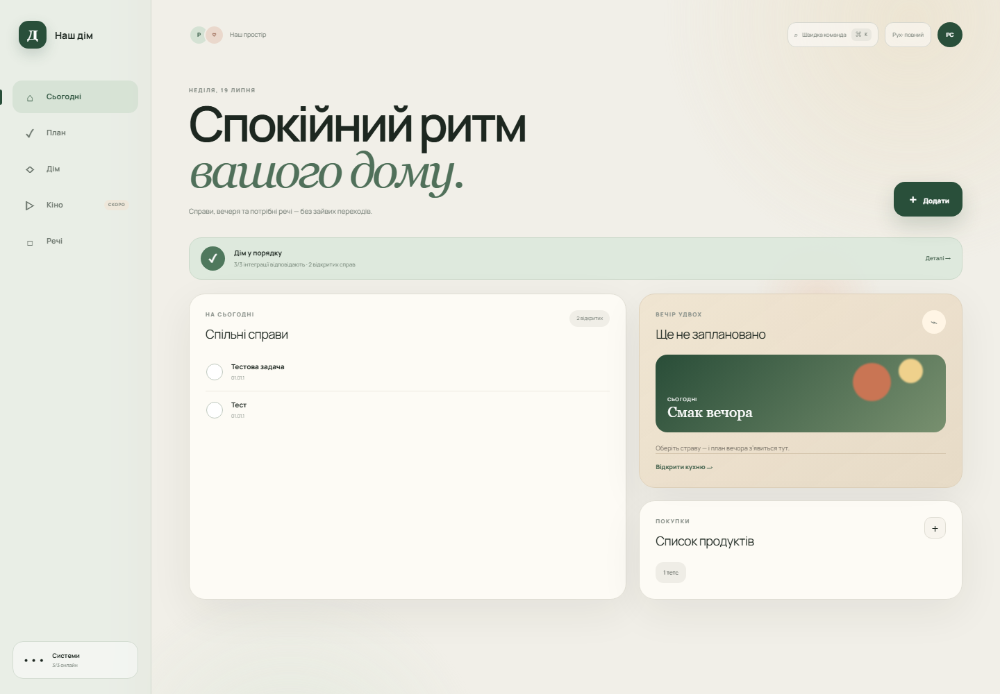
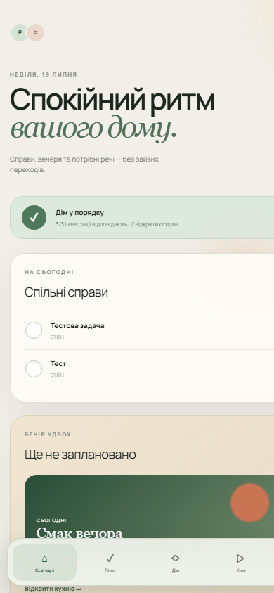
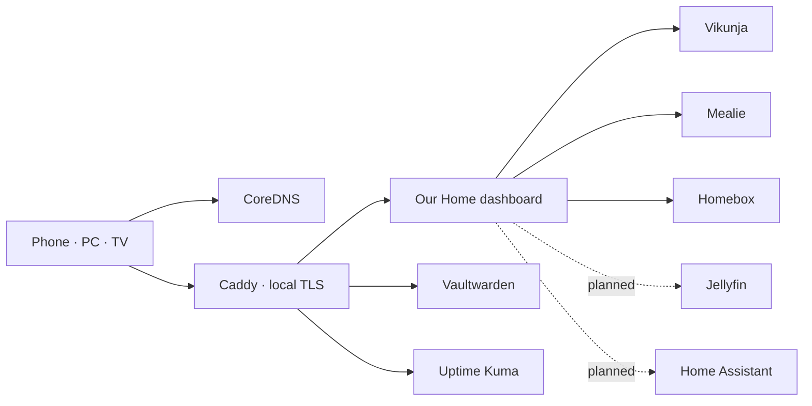

# Our Home

<p align="center">
  <strong>A quiet, local-first household command center for two people.</strong><br>
  Tasks, dinner, groceries, belongings, and service health — one calm surface instead of six admin panels.
</p>



<p align="center"></p>

## What works today

| Space | Capability | Source of truth |
|---|---|---|
| Today | Live household summary, tasks, dinner, groceries, belongings | Unified snapshot |
| Plan | Read, create, and complete shared tasks | Vikunja |
| Kitchen | Current meal and quick grocery capture | Mealie |
| Library | Browse and quickly register belongings | Homebox |
| Systems drawer | Integration health and safe links to specialist tools | Dashboard |
| Vault | Isolated credential manager link | Vaultwarden |

Cinema and smart-apartment spaces are intentionally labelled as upcoming. They contain no fabricated content.

## Interaction design

- Responsive five-space shell for desktop, phone, and future TV use.
- `Ctrl/Cmd + K` command palette for navigation and household capture.
- Contextual systems drawer with integration health and last-sync time.
- Full, reduced, and touch-friendly motion modes; preference is remembered locally.
- Loading, empty, integration-error, stale, and offline states.
- Keyboard focus, skip link, semantic dialogs, live notices, and 44 px minimum touch targets.

## Verified release metrics

Measured against commit `918c967` on 2026-07-19. Screenshots above are from the deployed home server with live integrations.

| Metric | Result | Budget / expectation |
|---|---:|---:|
| Production build | Passing | Passing |
| Automated dashboard tests | 3 / 3 passing | All passing |
| ESLint | 0 errors | 0 errors |
| Client JavaScript | 89.5 KB gzip | ≤ 180 KB gzip |
| Screenshot payload, desktop | 285 KB | ≤ 500 KB above fold |
| Screenshot payload, mobile | 86.6 KB | ≤ 500 KB above fold |
| Warm LAN HTML response | 126 ms | Informational |
| Live integrations | 3 / 3 healthy | 3 / 3 |
| Public application ports | 0 | 0 |

Accessibility verification currently covers automated linting plus manual keyboard, focus, reduced-motion, contrast-state, and 390 px/1440 px responsive checks. A browser accessibility runner is planned before public distribution.

## Architecture



The dashboard owns household **intents**, while each specialist service remains its source of truth. Integration credentials stay server-side and are never sent to the browser.

## Quick start

Prerequisites: a Debian/Ubuntu host, Docker Engine, Docker Compose, Git, and a stable LAN address.

```bash
git clone https://github.com/RomaSorokivskiy/homeservicehelper.git
cd homeservicehelper
bash scripts/generate-secrets.sh
bash scripts/configure-lan-access.sh
bash scripts/deploy.sh
```

After creating service accounts and API keys:

```bash
bash scripts/configure-integrations.sh
```

Open `https://home.home.arpa` from a device using the home DNS server. See [LAN access](docs/lan-access.md) and the [deployment runbook](docs/deployment-runbook.md) for client certificate and server setup.

## Development

```bash
cd dashboard
npm ci
npm run dev
npm run lint
npm test
```

## Product and engineering docs

- [Product blueprint](docs/product-blueprint.md)
- [Experience design](docs/experience-design.md)
- [Delivery roadmap](docs/delivery-roadmap.md)
- [Architecture](docs/architecture.md)
- [Hardware plan](docs/hardware.md)

## Security

- LAN access is not a permanent authorization boundary; household authentication remains on the roadmap.
- Tokens and generated secrets belong only in the server `.env` file.
- Vaultwarden secrets are never fetched by the dashboard.
- Remote access must use a VPN; never port-forward private services or DNS.
- Rotate any token that has appeared in chat, screenshots, shell history, or logs.

## License

Private household project. Add an explicit license before redistributing it as a public template.
