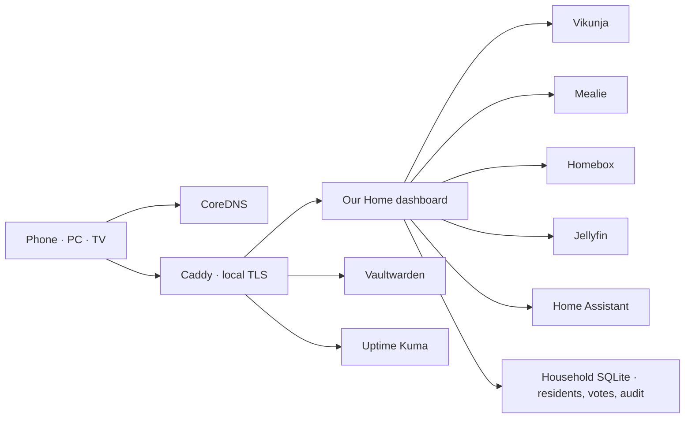

# Our Home

<p align="center">
  <strong>A quiet, local-first household command center for two people.</strong><br>
  Tasks, dinner, groceries, belongings, and service health — one calm surface instead of six admin panels.
</p>


<p align="center"></p>

## What works today

| Space | Capability | Source of truth |
|---|---|---|
| Today | Live agenda, dinner replacement/servings, grouped groceries, belongings | Unified snapshot |
| Plan | Create, edit, complete, postpone, recur, delete, and assign shared tasks | Vikunja + household state |
| Kitchen | One-hand shopping mode and recipe ingredients → groceries | Mealie |
| Library | Global search, rich capture, edit, quantity, warranty, and deletion | Homebox |
| Cinema | Jellyfin library/resume, shared queue, per-resident voting, playback controls | Jellyfin + household state |
| Home | Safety-first alerts, presence, energy, room summaries, and scenes | Home Assistant |
| Systems | Integration health, authenticated action audit, SLO, updates, and safe admin links | Dashboard |
| Vault | Isolated credential manager | Vaultwarden |

Five server adapters are live. The current Home Assistant instance has only system entities and a person entity, and the Jellyfin libraries contain no media yet; those empty states are shown honestly rather than populated with demo data.

## Interaction design

- Responsive five-space shell for desktop, phone, and future TV use.
- `Ctrl/Cmd + K` command palette for navigation and household capture.
- Contextual systems drawer with integration health and last-sync time.
- Full, reduced, and touch-friendly motion modes; preference is remembered locally.
- Loading, empty, integration-error, stale, and offline states.
- Keyboard focus, skip link, semantic dialogs, live notices, and 44 px minimum touch targets.

## Verified release metrics

Measured on 2026-07-19 against deployed commit `eee234a` using Playwright Chromium 140 at 1440×1000 over the wired LAN. The screenshots above are generated from the fully loaded authenticated desktop/mobile E2E suite.

| Metric | Result | Budget / expectation |
|---|---:|---:|
| Production build | Passing | Passing |
| API/render contract tests | 3 / 3 passing | All passing |
| Authenticated browser E2E | 6 / 6 passing | Desktop + Pixel 7, including Axe WCAG A/AA |
| ESLint | 0 errors | 0 errors |
| Client JavaScript | 105.0 KiB gzip | ≤ 180 KiB gzip |
| First Contentful Paint | 160 ms | ≤ 1.5 s wired LAN |
| DOM content loaded | 80 ms | Informational |
| Full page load | 147 ms | Informational |
| Warm authenticated navigation | 877 ms wall / 45 ms response | ≤ 1.5 s wired LAN |
| Live integrations | 5 / 5 healthy | 5 / 5 |
| 30-day SLO engine | 100% from first collected sample | Target 99.5%; insufficient history for a monthly claim |
| Public application ports | 0 | 0 |

The browser suite verifies desktop keyboard navigation, phone touch navigation, CSP-clean hydration, reduced motion, cached offline reload, authenticated access, responsive screenshots, and zero critical/serious Axe violations across WCAG A/AA tags.

## Architecture



The dashboard owns household **intents**, while each specialist service remains its source of truth. Integration credentials stay server-side and are never sent to the browser.

## Quick start

Prerequisites: a Debian/Ubuntu host, Docker Engine, Docker Compose, Git, and a stable LAN address.

```bash
git clone https://github.com/RomaSorokivskiy/homeservicehelper.git
cd homeservicehelper
bash scripts/generate-secrets.sh
bash scripts/configure-lan-access.sh
bash scripts/deploy.sh
```

After creating service accounts and API keys:

```bash
bash scripts/configure-integrations.sh
```

Open `https://home.home.arpa` from a device using the home DNS server. See [LAN access](docs/lan-access.md) and the [deployment runbook](docs/deployment-runbook.md) for client certificate and server setup.

## Development

```bash
cd dashboard
npm ci
npm run dev
npm run lint
npm test
npm run test:e2e
```

## Product and engineering docs

- [Product blueprint](docs/product-blueprint.md)
- [Experience design](docs/experience-design.md)
- [Delivery roadmap](docs/delivery-roadmap.md)
- [Architecture](docs/architecture.md)
- [Hardware plan](docs/hardware.md)

## Security

- The dashboard is protected by Caddy basic authentication; unauthenticated/authenticated probes are verified as `401`/`200`.
- Caddy forwards the authenticated household identity to the allowlisted action API, and every action is written to the persistent audit log.
- Tokens and generated secrets belong only in the server `.env` file.
- Vaultwarden secrets are never fetched by the dashboard.
- Remote access must use a VPN; never port-forward private services or DNS.
- Rotate any token that has appeared in chat, screenshots, shell history, or logs.

## Reliability

- Five-minute health history and a 30-day per-service SLO calculator (99.5% target).
- Daily PostgreSQL/volume backups and weekly restore drills.
- AES-256 encrypted off-site export with decrypt verification and SHA-256 checksums; a real external `OFFSITE_BACKUP_TARGET` must still be supplied.
- Weekly image-digest checks report updates without applying or restarting services.
- The browser caches the authenticated application shell and last normalized snapshot for read-only operation during short LAN outages.

## License

Private household project. Add an explicit license before redistributing it as a public template.
