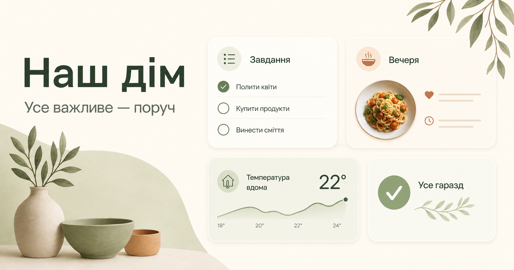
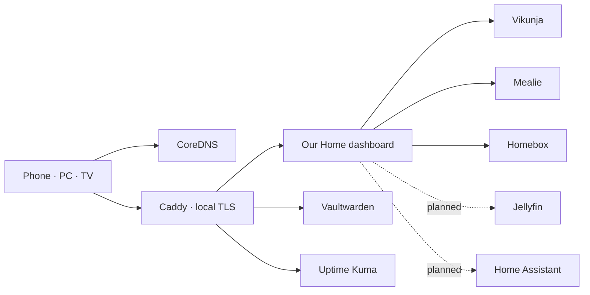

# Our Home

<p align="center">
  
</p>

<p align="center">
  <strong>A private, local-first household operating system for two people.</strong><br>
  Tasks, meals, groceries, belongings, service health, and future cinema and smart-home controls — without living in six admin panels.
</p>

## Status

This repository contains a working self-hosted foundation and an approved product blueprint for the next design and functionality phases.

| Area | Current state |
|---|---|
| Unified dashboard | Live on the home LAN |
| Vikunja tasks | Read, create, and complete from the dashboard |
| Mealie groceries and meal plan | Connected; quick grocery creation enabled |
| Homebox inventory | Connected; quick item creation enabled |
| Vaultwarden | Isolated safe link and health boundary |
| Local DNS and TLS | CoreDNS + Caddy, private `home.arpa` names |
| Cinema | Designed, not implemented yet |
| Smart apartment | Designed, not implemented yet |

## Verified project metrics

Measured on the current repository baseline; aspirational budgets live in the design docs.

| Metric | Value |
|---|---:|
| Dashboard API integrations | 3 |
| Household HTTPS routes | 6 |
| Automated dashboard tests | 3 passing |
| Long-running Compose services | 10 |
| Publicly exposed application ports | 0 |
| LAN infrastructure ports | DNS 53, HTTPS 443, HTTP redirect 8088 |

## Architecture



The dashboard owns household **intents**, not specialist data. Vikunja, Mealie, Homebox, Vaultwarden, and future Jellyfin/Home Assistant installations remain the sources of truth. Integration credentials stay server-side.

## Product direction

- [Product context](product-context.md)
- [Product blueprint](docs/product-blueprint.md)
- [Experience and visual direction](docs/experience-design.md)
- [Delivery roadmap](docs/delivery-roadmap.md)
- [Architecture](docs/architecture.md)
- [LAN access](docs/lan-access.md)
- [Deployment runbook](docs/deployment-runbook.md)
- [Hardware plan](docs/hardware.md)

## Quick start

Prerequisites: a Debian/Ubuntu host, Docker Engine, Docker Compose, Git, and a stable LAN address.

```bash
git clone https://github.com/RomaSorokivskiy/homeservicehelper.git
cd homeservicehelper
bash scripts/generate-secrets.sh
bash scripts/configure-lan-access.sh
bash scripts/deploy.sh
```

After creating accounts and service API keys:

```bash
bash scripts/configure-integrations.sh
```

Open `https://home.home.arpa` from a device using the home DNS server. See the LAN guide for certificate and client setup.

## Development

```bash
cd dashboard
npm ci
npm run dev
npm run lint
npm test
```

## Documentation and evidence policy

Every product update must update this English README in the same commit. UI releases must include real desktop and mobile screenshots under `docs/assets/`, plus reproducible accessibility, performance, bundle, and test metrics. Planned features are never presented as shipped.

## Security

- LAN is not a permanent authorization boundary; authenticated household access is on the roadmap.
- Tokens and generated secrets belong only in the server `.env` file.
- Vaultwarden secrets are never fetched by the dashboard.
- Remote access must use a VPN; do not port-forward private services or DNS.
- Rotate any token that has appeared in chat, screenshots, shell history, or logs.

## License

Private household project. Add an explicit license before redistributing it as a public template.
