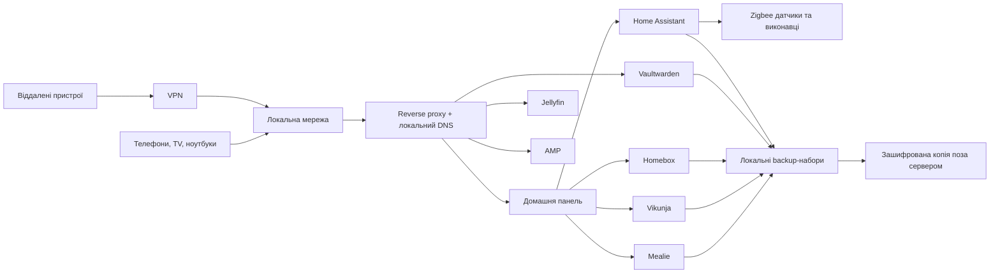

# Архітектура сервісів

## Топологія

## Платформа

- Linux host: Debian Stable.
- Сервіси: Docker Compose, згрупований за доменами `core`, `home`, `media`, `games`, `observability`.
- Home Assistant: окрема VM, якщо використовується гіпервізор; інакше окремий контейнер із чітко зафіксованими USB-пристроями.
- Дані: локальні bind mounts/volumes на дзеркальному NVMe; медіа на HDD-пулі.
- Доступ: локальні DNS-імена та TLS; ззовні тільки VPN. Публічні адмін-панелі заборонені.
- Ідентичність: на першому етапі окремі акаунти сервісів; SSO не додавати, доки два користувачі не відчують реальної потреби.

## Межі власної розробки

Домашня панель не копіює функції готових продуктів і не стає новим сховищем паролів чи рецептів.

- Mealie володіє рецептами, планом харчування та списком продуктів.
- Vikunja володіє задачами, повтореннями та домашніми проєктами.
- Homebox володіє речами, місцями, гарантіями й обслуговуванням.
- Vaultwarden відкривається окремим захищеним клієнтом; панель показує лише безпечні ярлики/стан, ніколи секрети.
- Home Assistant володіє станами пристроїв, сценами й автоматизаціями.
- Панель агрегує read-only картки та запускає вузький набір дозволених дій через server-side adapters.

## Надійність і відновлення

- Щоденний backup баз даних та конфігурацій; щотижнева перевірка копіювання на інший фізичний носій.
- Зашифрована off-site копія фотографій, документів, паролів і конфігурації; медіафайли можна виключити, якщо їх легко відновити.
- Щомісячний тест відновлення одного сервісу в тимчасове оточення.
- Оновлення щомісяця пакетами: спочатку backup, потім некритичні сервіси, далі критичні.
- Uptime Kuma перевіряє доступність; SMART і температури дисків формують сповіщення.

